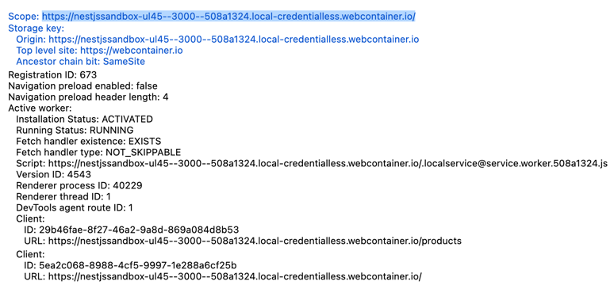

# Instructions for Candidates to Run the Project on StackBlitz

StackBlitz is an online IDE that enables you to run Node.js applications directly in the browser by utilizing Service Workers to intercept and handle HTTP requests:


**Important:** Due to Service Worker scope, HTTP requests can only be made from:
- The same origin (domain) as the application
- The StackBlitz IDE's integrated terminal

This means external tools (like Postman or cURL from your local machine) will not work.

## API Endpoints & Example cURL Commands

### Products (Catalogue)

**Create a Product:**
```bash
curl -X POST http://localhost:3000/products \
  -H "Content-Type: application/json" \
  -d '{"name": "Cloud Storage", "description": "Secure cloud storage solution"}'
```

**Get All Products:**
```bash
curl http://localhost:3000/products
```

**Get a Product by ID:**
```bash
curl http://localhost:3000/products/{productId}
```

**Update a Product:**
```bash
curl -X PATCH http://localhost:3000/products/{productId} \
  -H "Content-Type: application/json" \
  -d '{"name": "Premium Cloud Storage", "description": "Enhanced cloud storage"}'
```

**Delete a Product:**
```bash
curl -X DELETE http://localhost:3000/products/{productId}
```

